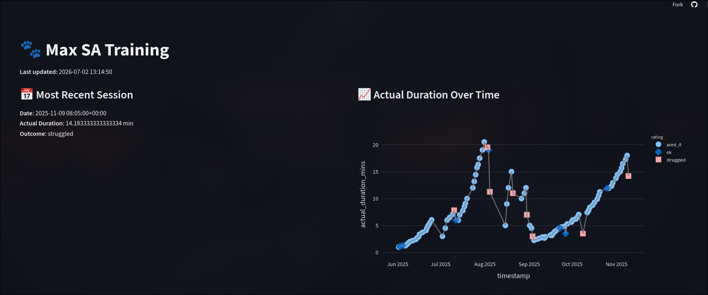

# separation_anxiety_tracker
[](https://github.com/sdysch/separation_anxiety_tracker/actions/workflows/install.yml)
[](https://github.com/sdysch/separation_anxiety_tracker/actions/workflows/update_db.yml)

Tracking training progress for my dog's separation anxiety, based on Julie Naismith's be right back method

To scrape data from the [app](https://berightbackapp.io/), login and use developer console to find the session cookie.
Put this in a secrets.yml file (follow the example [here](secrets_example.yml)

## Overall progress
See progress [here](https://max-sa-training.streamlit.app/)



## Install
```bash
conda create -n sa_tracker python=3.12
conda activate sa_tracker
pip install -e .
```

TODO
- [X] Read raw data from google sheets
- [X] Add in warmup support (figure out how to scrape from BRB app)
- [ ] DB hosting?
- [X] Automated read of hosted DB (daily? cron from google sheets?)
	* Kinda done with scheduled github actions
- [ ] do not duplicate DB entries
- [ ] check for rating
- [X] Streamlit?
